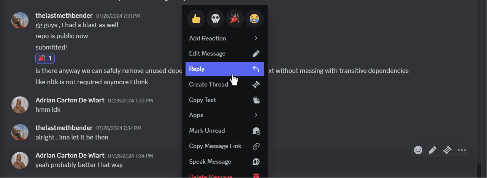

# Suave supernovae


>In the fast-paced world of Discord, managing and making sense of extensive text conversations can be challenging.
>As the volume of messages grows, it becomes increasingly difficult to stay informed and engaged in discussions.
>Our solution addresses this problem with a bot designed to streamline and simplify text management on Discord.


Welcome to the code repository of 'Suave Supernovae' for the Python Discord Code Jam 2024!

We are excited to present our Discord Text Management Bot. As communication on Discord grows more complex, traditional methods for managing and understanding conversations can become inadequate. This challenge can make it difficult for users to stay informed and engaged, especially in active or large servers.

Our approach introduces features designed to enhance conversation management.

This approach aims to alleviate the difficulties associated with text overload and improve the overall experience of managing and participating in Discord discussions.


## Contents

This README consists of the following sections:

- [Contents](#contents)
- [Features](#features)
- [User Guide](#user-guide)
- [Installation](#installation)
- [How to Run the Project](#how-to-run-the-project)
- [Contributors](#contributors)

In addition, each subfolder has another README detailing the architecture and design choices for each part of the app.

| Folder                             | Description                                                                                                                     |
| ---------------------------------- | ------------------------------------------------------------------------------------------------------------------------------- |
| [``](./)           | Placeholder text                                              |
| [``](./) | Placeholder text                                        |
| [``](./) | Placeholder text. |
| [``](./)   | Placeholder text  


## Features

Our project has the following key features:

- Developed using **Disnake**, a Python library for building Discord bots.
- **AI-powered summarizer** that delivers a **concise summary** of conversations in any text channel, allowing users to quickly grasp ongoing discussions.
- **Ask the bot** feature lets users query the bot about any topic, even if it hasn’t been mentioned in the current conversation, avoiding the need to search through past messages or leave Discord.
- Gives users the ability to **fetch Wikipedia articles** on specific topics directly within the Discord channel, providing instant access to relevant information.
- **Message saver** functionality enables users to **save and retrieve important messages** swiftly, ensuring easy access to critical information.
- **Help command** offers descriptions of all available commands, helping users understand and utilize the bot’s features effectively.

## User Guide

Before you can use the discord bot, there are some setup steps you need to follow. This ensures the application works flawlessly on your local machine.


### Prerequisites

1. **Installation**: Before anything else, you need to set up the environment. Please follow our detailed [installation](#installation) guide to get everything in place.

2. **Running the bot**: Once installed, the next step is to start the bot.  please follow the guide on [how to run the project](#how-to-run-the-project).

### Using the App

With the application up and running, you can now explore the discord bot's capabilities:

1. To save messages simply select your message of choice and when the context menu pops up you should see a section named apps. Inside of that section you should see the ability to save a message.
</img>

2. To view your saved messages

## Installation

Below are instructions on various ways to install this project. You can choose to either:

1. [Set up a local development environment](#local-installation), or
2. [Use the provided development container](#dev-container-installation) (requires Docker)

### Local Installation

To develop this project on your local machine, follow the steps outlined below.

> **Note**: Ensure you have Python version 3.11 installed. If not, download it from [here](https://www.python.org/downloads/).

1. To install the project locally you first need to run the following line to install all of its requirements

```
pip install -r requirements.txt
```

### Dev Container Installation

> **Note**: Due to last minute implementations you will have to rename env.local to .env.local in the docker file if you wish to use this approach


This project includes a [development container](https://containers.dev/) to simplify the setup process and provide a consistent development environment.

You can use the dev container locally with either [Visual Studio Code](#visual-studio-code) or [PyCharm](#pycharm), or remotely with [GitHub Codespaces](#github-codespaces).

#### Visual Studio Code

> **Note**: The following instructions assume that you have already installed [Docker](https://www.docker.com/) and [Visual Studio Code](https://code.visualstudio.com/).

1. Install the [Remote Development extension pack](https://marketplace.visualstudio.com/items?itemName=ms-vscode-remote.vscode-remote-extensionpack) in Visual Studio Code.

2. Make sure the Docker agent is running, and open Visual Studio Code.

3. Press `F1` to open the command palette, and then type "Dev-Containers: Clone Repository in Container Volume" and select it from the list. Alternatively, you can click on the green icon in the bottom-left corner of the VS Code window and select "Dev-Containers: Clone Repository in Container Volume" from the popup menu.

4. Next, the command palette will ask you for the repository URL. Copy the URL of the GitHub repository, paste it into the command palette and confirm by pressing `Enter`.

5. VS Code will automatically build the container and connect to it. This might take some time for the first run as it downloads the required Docker images and installs extensions.

6. Once connected, you'll see "Dev Container: Suave Supernova" in the bottom-left corner of the VS Code window, indicating that you are now working inside the container.

7. You're all set! You can now run, develop, build, and test the project using the provided development environment.

#### PyCharm

To connect PyCharm to the Development Container, please [follow these instructions](https://www.jetbrains.com/help/pycharm/connect-to-devcontainer.html) provided in the official JetBrains documentation.

#### GitHub Codespaces

> **Note**: GitHub Codespaces is a paid service. At the time of writing, it offers 60 hours of development time for free every month. Use with care.

1. Ensure that you have access to [GitHub Codespaces](https://github.com/features/codespaces).

2. Navigate to the GitHub repository for the project.

3. Click the "Code" button and then select "Open with Codespaces" from the dropdown menu.

4. Click on the "+ New codespace" button to create a new Codespace for the project.

5. GitHub Codespaces will automatically build the container and connect to it. This might take some time for the first run as it downloads the required Docker images and installs extensions.

6. Once connected, you'll see "Dev Container: Suave Supernova" in the bottom-left corner of the VS Code window, indicating that you are now working inside the container.

7. You're all set! You can now run, develop, build, and test the project using the provided development environment.


## How to Run the Project


### Using the Shell Script

Navigate to the project root directory and execute the following command:

```bash

```

### For Windows Users


```bash

```

### Accessing the App


> **Note:** .

## Contributors

This project was built by `Suave Supernovae` team as part of the Python Discord Code Jam 2024. These are the team members and their main contributions:

| Avatar                                                     | Name                                        | Main contributions            |
| ---------------------------------------------------------- | ------------------------------------------- | ----------------------------- |
|    | [Aekardy](https://github.com/Aekardy) |  placeholder text   |
|      | [Adrian Carton De Wiart](https://github.com/kian3158)  | placeholder text |
|  | [TheLastMethBender](https://github.com/theredditbandit)     | placeholder text   |
|      | [NaviTheCoderBoi](https://github.com/NaviTheCoderboi)      | placeholder text         |
|   | [Butter Dog](https://github.com/Shubham-Mate)   | placeholder text   |
